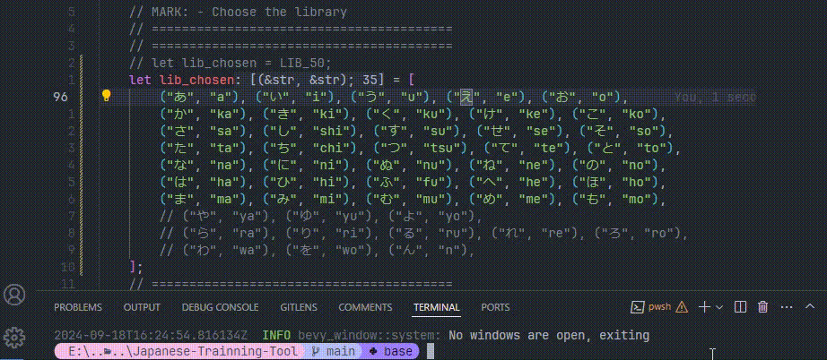
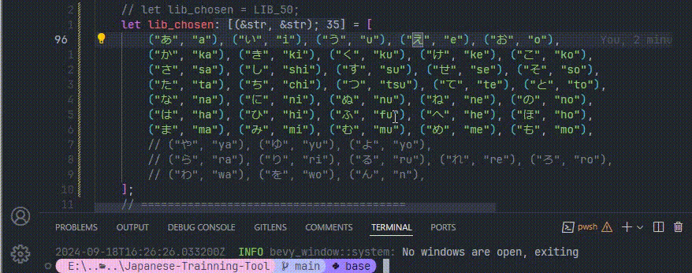
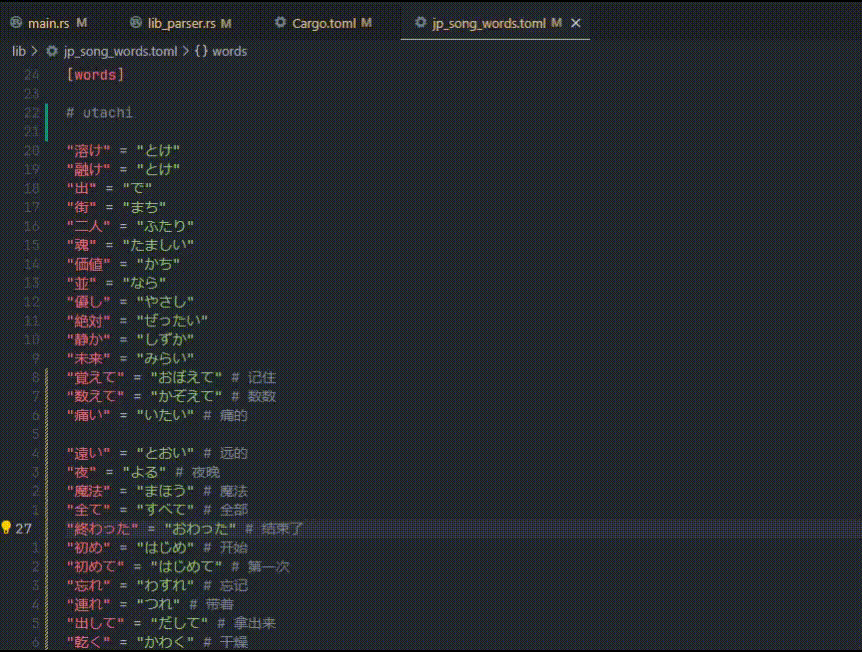

# Japanese-Trainning-Tool

> 个人使用

* 一个帮你快速建立符号之间映射的工具
  * 使用例：学习五十音图
  * 使用例：学习日语歌的汉字读音
* 从词库中随机选取符号对
  * 
* 修改词库
  * 
* 日语歌曲汉字练习
  * 支持通过toml格式自定义词库，使用 `cargo run ./lib/file_name.toml` 指定词库文件
  * 
* 如何使用？
  * 安装Rust
  * 在终端输入`cargo run`
  * 搞定！
* 技术栈
  * 基于Rust + Bevy游戏引擎